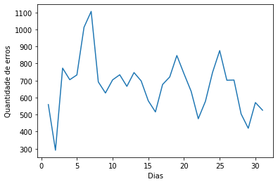

## LinkedIn: https://www.linkedin.com/in/matheusjerico
## E-mail: matheusjerico1994@hotmail.com

## Respondendo Questões:

1. Qual​ ​ o ​ ​ objetivo​ ​ do​ ​ comando​ ​ cache​ ​ em​ ​ Spark?
O objetivo é colocar o dataset em memória cache. As memórias caches (L1, L2 e L3) possuem uma performace bem superior do que a memória RAM. Em um cluster de computadores, a quantidade de memória cache é bastante significante, tendo em vista que em um computador comercial a memória cache é bem pequena, abaixo dos 10MB.
Colocar os dados em memória cache é muito útil quando o dado é acessado repetidamente, desde quando a operação realizada é uma busca em um pequeno dataset até operações iterativas de algoritmos de machine learning.

2. O​ ​ mesmo​ ​ código​ ​ implementado​ ​ em​ ​ Spark​ ​ é ​ ​ normalmente​ ​ mais​ ​ rápido​ ​ que​ ​ a ​ ​ implementação​ ​ equivalente​ ​ em
MapReduce.​ ​ Por​ ​ quê?
Porque o código implementado em Spark roda em memória, já o código MapReduce precisa ler e escrever em disco. A velocidade de leitura em memória é muito mais rápido do que em disco.

3. Qual​ ​ é ​ ​ a ​ ​ função​ ​ do​ ​ SparkContext​ ?
A função do SparkContext é criar um ponto de entrada para qualquer funcionalidade do Apache Spark. É o objeto central que coordena as aplicações Spark em um cluster. A partir da criação de um SparkContext é possivel se conectar ao gerenciador do cluster.
Um fato relevante, é que só é possível criar um SparkContext.

4. Explique​ ​ com​ ​ suas​ ​ palavras​ ​ ​ o ​ ​ que​ ​ é ​ ​ Resilient​ ​ Distributed​ ​ Datasets​​ ​ (RDD).
É o objeto base do Spark, que é distribuido entre os DataNodes em um cluster. A partir do objeto RDD, é possível armazenar e processar dados de forma distribuída.

5. GroupByKey​ ​ é ​ ​ menos​ ​ eficiente​ ​ que​ ​ reduceByKey​ ​ em​ ​ grandes​ ​ dataset.​ ​ Por​ ​ quê?
A utilização de ambas funções chegam ao mesmo resultado. Entretando, como dito, reduceByKey é mais eficiente pois quando ocorre o processo de redução, os pares em uma mesma partição são combinados (as chaves que possuem o mesmo valor são combinadas), e isso é realizado antes do embaralhamento. Apenas uma saída para cada chave em uma partição é enviado para o processo de embaralhamento. Essa tarefa otimiza o processamento de redução.

## Explique​ ​ o ​ ​ que​ ​ o ​ ​ código​ ​ Scala​ ​ abaixo​ ​ faz.
``` scala
val​​ textFile​​ ​= ​sc​.textFile​ ("hdfs://...")
val​​ ​counts​​ ​= textFile​.flatMap​(line => line.split(" "))
		  .map(word => (word, 1))
		  .reduceByKey​(_+_)
counts​.saveAsTextFile​("hdfs://..."​)
```

**val​​ textFile​​ ​= ​sc​.textFile​ ( ​ "hdfs://..."​ )**
- Carrega um arquivo que está presente no hdfs (Hadoop Distributed File System) e atribui para o objeto textFile, que é do tipo RDD.

**val​​ ​counts​​ ​= textFile​.flatMap​(line => line.split(" "))**
- A partir do objeto RDD textFile, é aplicada a função flatMap, que realiza um map de uma função (que no caso é a função .split()) de forma mais profunda, aplicando um flatten antes do mapeamento (utilizado quando temos uma lista dentro de outra lista). O flatMap aplicada a função split em todas as linhas, o separador das palavras é o " " (espaço), que é valor que está presente entre as palavras. O resultado dessa operação é a criação de um objeto com as palavras.

**		  .map(word => (word, 1))**
- Aqui é realizado o mapeamento de cada palavra, para um par de "chave: valor".

**		  .reduceByKey​(_+_)**
- Aqui ocorre o processo de redução por chave. O resultado final desse processo é um par de "chave: quantidade de aparições da palavra no objeto textFile".

**counts​.saveAsTextFile​("hdfs://..."​)**
- Salva o objeto criado no procedimento de mapeamento e redução como arquivo no hdfs.


## HTTP​ ​ requests​ ​ to​ ​ the​ ​ NASA​ ​ Kennedy​ ​ Space​ ​ Center​ ​ WWW​ ​ server
---
**Fonte​ ​ oficial​ ​ do​ ​ dateset​ : ​ ​ http://ita.ee.lbl.gov/html/contrib/NASA-HTTP.html**
**Dados​:**

**Sobre o dataset​**: Esses dois conjuntos de dados possuem todas as requisições HTTP para o servidor da NASA Kennedy
Space​ ​ Center​ ​ WWW​ ​ na​ ​ Flórida​ ​ para​ ​ um​ ​ período​ ​ específico.
---
Os​ ​ logs​ ​ estão​ ​ em​ ​ arquivos​ ​ ASCII​ ​ com​ ​ uma​ ​ linha​ ​ por​ ​ requisição​ ​ com​ ​ as​ ​ seguintes​ ​ colunas:
- **Host fazendo a requisição​**. Um hostname quando possível, caso contrário o endereço de internet se o nome
não​ ​ puder​ ​ ser​ ​ identificado.
- **Timestamp​** no​ formato​ ​ "DIA/MÊS/ANO:HH:MM:SS​ ​ TIMEZONE"
- **Requisição​ ​ (entre​ ​ aspas)**
- **Código​ ​ do​ ​ retorno​ ​ HTTP**
- **Total​ ​ de​ ​ bytes​ ​ retornados**

##Questões
​Responda​ ​ as​ ​ seguintes​ ​ questões​ ​ devem​ ​ ser​ ​ desenvolvidas​ ​ em​ ​ Spark​ ​ utilizando​ ​ a ​ ​ sua​ ​ linguagem​ ​ de​ ​ preferência.
1. Número​ ​ de​ ​ hosts​ ​ únicos.
2. O​ ​ total​ ​ de​ ​ erros​ ​ 404.
3. Os​ ​ 5 ​ ​ URLs​ ​ que​ ​ mais​ ​ causaram​ ​ erro​ ​ 404.
4. Quantidade​ ​ de​ ​ erros​ ​ 404​ ​ por​ ​ dia.


# Respondendo Questões

## 1. Números de Hosts únicos


```python
hostsUnique = spSession.sql("SELECT COUNT (DISTINCT HOST) as COUNT_UNIQUE_HOSTS FROM dataset").collect()
print(hostsUnique)
```

    [Row(COUNT_UNIQUE_HOSTS=137979)]


```python
print("Quantidade de Hosts únicos: {}"\
                                      .format(hostsUnique[0]['COUNT_UNIQUE_HOSTS']))
```

    Quantidade de Hosts únicos: 137979


## 2. Total de erros 404


```python
%%time
totalErros404WithSQL = spSession.sql("SELECT COUNT(COD_HTTP) as COUNT_HTTP_ERROR \
                                      FROM dataset WHERE COD_HTTP = 404").first()
```

    CPU times: user 3.4 ms, sys: 160 µs, total: 3.56 ms
    Wall time: 1.34 s


```python
print("Total de error '404': {}".format(totalErros404WithSQL[0]))
```

    Total de error '404': 20871


```python
%%time
totalErros404WithFilter = dataset_final.filter("COD_HTTP == 404").count()
```

    CPU times: user 1.18 ms, sys: 55 µs, total: 1.24 ms
    Wall time: 1.32 s


```python
print("Total de erros '404': {}".format(totalErros404WithFilter))
```

    Total de erros '404': 20871


## 3. As 5 URLs que mais causaram erro 404


```python
url404 = spSession.sql("SELECT HOST, COUNT(COD_HTTP) FROM dataset\
                        WHERE COD_HTTP = 404 GROUP BY HOST ORDER BY\
                        COUNT(COD_HTTP) DESC").take(10)
```


```python
print("As 5 URLs que mais causaram erro 404:\n")
for i in range(0,5):
    print("{}º: url:'{}' com '{}' erros 404\n".format((i+1), 
                                                     url404[i]["HOST"],
                                                     url404[i]["count(COD_HTTP)"]))
```

    As 5 URLs que mais causaram erro 404:
    
    1º: url: 'hoohoo.ncsa.uiuc.edu' com '251' erros 404
    
    2º: url: 'piweba3y.prodigy.com' com '156' erros 404
    
    3º: url: 'jbiagioni.npt.nuwc.navy.mil' com '132' erros 404
    
    4º: url: 'piweba1y.prodigy.com' com '114' erros 404
    
    5º: url: 'www-d4.proxy.aol.com' com '91' erros 404
    


```python
url404[:5]
```


    [Row(HOST='hoohoo.ncsa.uiuc.edu', count(COD_HTTP)=251),
     Row(HOST='piweba3y.prodigy.com', count(COD_HTTP)=156),
     Row(HOST='jbiagioni.npt.nuwc.navy.mil', count(COD_HTTP)=132),
     Row(HOST='piweba1y.prodigy.com', count(COD_HTTP)=114),
     Row(HOST='www-d4.proxy.aol.com', count(COD_HTTP)=91)]


## 4. Quantidade de erros 404 por dia


```python
dia404 = spSession.sql("SELECT DAY, COUNT(COD_HTTP) FROM dataset\
                        WHERE COD_HTTP = 404 GROUP BY DAY ORDER BY\
                        DAY ASC").collect()
```


```python
dia404
```


    [Row(DAY='01', count(COD_HTTP)=559),
     Row(DAY='02', count(COD_HTTP)=291),
     Row(DAY='03', count(COD_HTTP)=773),
     Row(DAY='04', count(COD_HTTP)=705),
     Row(DAY='05', count(COD_HTTP)=733),
     Row(DAY='06', count(COD_HTTP)=1013),
     Row(DAY='07', count(COD_HTTP)=1106),
     Row(DAY='08', count(COD_HTTP)=692),
     Row(DAY='09', count(COD_HTTP)=627),
     Row(DAY='10', count(COD_HTTP)=704),
     Row(DAY='11', count(COD_HTTP)=734),
     Row(DAY='12', count(COD_HTTP)=666),
     Row(DAY='13', count(COD_HTTP)=747),
     Row(DAY='14', count(COD_HTTP)=698),
     Row(DAY='15', count(COD_HTTP)=581),
     Row(DAY='16', count(COD_HTTP)=516),
     Row(DAY='17', count(COD_HTTP)=677),
     Row(DAY='18', count(COD_HTTP)=721),
     Row(DAY='19', count(COD_HTTP)=847),
     Row(DAY='20', count(COD_HTTP)=740),
     Row(DAY='21', count(COD_HTTP)=637),
     Row(DAY='22', count(COD_HTTP)=476),
     Row(DAY='23', count(COD_HTTP)=578),
     Row(DAY='24', count(COD_HTTP)=748),
     Row(DAY='25', count(COD_HTTP)=876),
     Row(DAY='26', count(COD_HTTP)=702),
     Row(DAY='27', count(COD_HTTP)=703),
     Row(DAY='28', count(COD_HTTP)=504),
     Row(DAY='29', count(COD_HTTP)=420),
     Row(DAY='30', count(COD_HTTP)=571),
     Row(DAY='31', count(COD_HTTP)=526)]


```python
listErro404 = [int((dia404)[i][1]) for i in range(0,31)]
dias = [int((dia404)[i][0]) for i in range(0,31)]
```


```python
ax = sns.lineplot(x=dias, y=listErro404)
ax.set_xlabel('Dias')
ax.set_ylabel('Quantidade de erros')
```


    Text(0, 0.5, 'Quantidade de erros')





## 5. O total de bytes retornados


```python
totalBytes = spSession.sql("SELECT COUNT(TOTAL_BYTES) as TOTAL_BYTES FROM dataset").first()
```


```python
print("Total de bytes: {}".format(totalBytes[0]))
```

    Total de bytes: 3461612


# FIM
